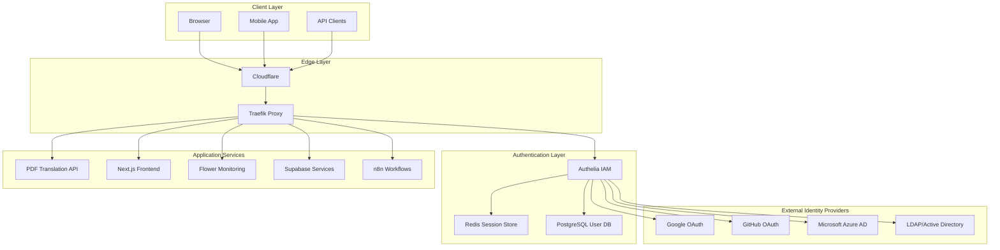

# Modern Authentication Stack Proposal for PDF Translation Platform

## Executive Summary

This proposal outlines a comprehensive, modern authentication stack for the PDF Translation Platform that addresses current limitations with Traefik basic auth and provides a scalable foundation for future microservices including Supabase and n8n integration.

## Current State Analysis

### Issues with Current Implementation
- **Basic Auth Limitations**: Traefik basic auth causes authentication loops and poor UX
- **No SSO Support**: Each service requires separate authentication
- **Limited User Management**: No user registration, profiles, or role management
- **Security Concerns**: No 2FA, session management, or audit trails
- **Future Scaling Issues**: Adding Supabase and n8n will create authentication silos

### Services Requiring Authentication
- **Current**: Flower monitoring dashboard
- **Planned**: Supabase admin panels, n8n workflow editor
- **Future**: User-facing PDF translation interface, admin dashboards

## Recommended Architecture: Authelia + OAuth/OIDC

### Why Authelia?

Based on 2025 research, Authelia is the optimal choice for our microservices architecture:

**✅ Perfect for Reverse Proxy Integration**
- Native Traefik integration with forward auth
- Lightweight (20MB container, 30MB RAM usage)
- Designed specifically for Docker-based environments
- Millisecond authorization performance

**✅ Comprehensive Security Features**
- Multi-factor authentication (TOTP, WebAuthn, Duo Push)
- Passwordless authentication via Passkeys
- Fine-grained access control per subdomain/user/resource
- Session management with Redis storage
- Account lockout protection

**✅ Future-Ready Integration**
- OpenID Connect 1.0 Provider (OpenID Certified™)
- OAuth 2.0 support for modern applications
- Works seamlessly with Supabase and n8n
- Extensive identity provider federation

## Proposed Architecture



## Implementation Plan

### Phase 1: Core Authelia Setup (Week 1)

**1.1 Infrastructure Setup**
```yaml
# docker-compose.yml additions
services:
  authelia:
    image: authelia/authelia:4.39
    container_name: authelia
    volumes:
      - ./authelia:/config
    networks:
      - traefik-proxy
      - authelia-backend
    environment:
      - AUTHELIA_JWT_SECRET=${AUTHELIA_JWT_SECRET}
      - AUTHELIA_SESSION_SECRET=${AUTHELIA_SESSION_SECRET}
    labels:
      traefik.enable: "true"
      traefik.http.routers.authelia.rule: "Host(`auth.edcopo.info`)"
      traefik.http.routers.authelia.entrypoints: "websecure"
      traefik.http.routers.authelia.tls.certresolver: "cloudflare"
      traefik.http.middlewares.authelia.forwardauth.address: "http://authelia:9091/api/authz/forward-auth"
      traefik.http.middlewares.authelia.forwardauth.trustForwardHeader: "true"
      traefik.http.middlewares.authelia.forwardauth.authResponseHeaders: "Remote-User,Remote-Groups,Remote-Name,Remote-Email"

  authelia-redis:
    image: redis:7-alpine
    container_name: authelia-redis
    volumes:
      - authelia_redis_data:/data
    networks:
      - authelia-backend
```

**1.2 Basic Configuration**
```yaml
# authelia/configuration.yml
server:
  host: 0.0.0.0
  port: 9091
  path: ""

log:
  level: info

authentication_backend:
  password_reset:
    disable: false
  file:
    path: /config/users_database.yml
    password:
      algorithm: argon2id

access_control:
  default_policy: deny
  rules:
    - domain: flower.edcopo.info
      policy: one_factor
    - domain: auth.edcopo.info
      policy: bypass
    - domain: "*.edcopo.info"
      policy: two_factor

session:
  name: authelia_session
  domain: edcopo.info
  same_site: lax
  expiration: 1h
  inactivity: 5m
  redis:
    host: authelia-redis
    port: 6379

regulation:
  max_retries: 3
  find_time: 120
  ban_time: 300

storage:
  postgres:
    host: db
    port: 5432
    database: pdftr
    schema: authelia
    username: user
    password: password

notifier:
  smtp:
    host: smtp.gmail.com
    port: 587
    username: noreply@edcopo.info
    password: ${SMTP_PASSWORD}
    sender: PDF Platform <noreply@edcopo.info>
```

### Phase 2: Service Integration (Week 2)

**2.1 Update Flower Service**
```yaml
# Replace current auth with Authelia middleware
  monitor:
    build: ./backend
    command: celery -A app.workers.celery_worker.celery_app flower --port=5555
    labels:
      traefik.enable: "true"
      traefik.http.routers.flower.rule: "Host(`flower.edcopo.info`)"
      traefik.http.routers.flower.middlewares: "authelia@docker"
      traefik.http.services.flower.loadbalancer.server.port: "5555"
```

**2.2 Protect All Services**
```yaml
# Apply to all sensitive routes
labels:
  traefik.http.routers.service-name.middlewares: "authelia@docker"
```

### Phase 3: Advanced Features (Week 3)

**3.1 Multi-Factor Authentication**
```yaml
# authelia/configuration.yml
totp:
  issuer: edcopo.info
  algorithm: sha1
  digits: 6
  period: 30
  skew: 1

webauthn:
  display_name: PDF Translation Platform
  attestation_conveyance_preference: indirect
  user_verification: preferred
  timeout: 60s
```

**3.2 OpenID Connect Provider**
```yaml
identity_providers:
  oidc:
    hmac_secret: ${AUTHELIA_OIDC_HMAC_SECRET}
    issuer_private_key: ${AUTHELIA_OIDC_PRIVATE_KEY}
    clients:
      - id: supabase
        description: Supabase Integration
        secret: ${SUPABASE_OIDC_SECRET}
        public: false
        authorization_policy: two_factor
        redirect_uris:
          - https://supabase.edcopo.info/auth/callback
        scopes:
          - openid
          - profile
          - email
          - groups
      - id: n8n
        description: n8n Workflow Automation
        secret: ${N8N_OIDC_SECRET}
        public: false
        authorization_policy: two_factor
        redirect_uris:
          - https://workflows.edcopo.info/rest/oauth2-credential/callback
        scopes:
          - openid
          - profile
          - email
```

## Future Service Integration

### Supabase Integration

**Authentication Flow**:
1. Users authenticate via Authelia
2. Supabase configured as OIDC client
3. JWT tokens exchanged between services
4. Row-level security policies based on Authelia groups

**Configuration**:
```sql
-- Supabase RLS policies
CREATE POLICY "authenticated_users_only" ON documents
FOR ALL TO authenticated
USING (auth.jwt() ->> 'groups' ? 'pdf_users');
```

### n8n Integration

**SSO Setup**:
```yaml
# n8n environment variables
N8N_SSO_OIDC_ENABLED=true
N8N_SSO_OIDC_ISSUER=https://auth.edcopo.info
N8N_SSO_OIDC_CLIENT_ID=n8n
N8N_SSO_OIDC_CLIENT_SECRET=${N8N_OIDC_SECRET}
N8N_SSO_OIDC_REDIRECT_URL=https://workflows.edcopo.info/rest/oauth2-credential/callback
```

**Workflow Authentication**:
- OAuth2 credentials managed via Authelia
- API access tokens for external services
- Centralized credential management

## Security Benefits

### Enhanced Security Posture
- **Zero Trust Architecture**: Every request authenticated and authorized
- **Defense in Depth**: Multiple authentication factors required
- **Session Management**: Secure session handling with Redis
- **Audit Trails**: Comprehensive logging of all authentication events

### User Experience Improvements
- **Single Sign-On**: One login for all services
- **Modern Authentication**: Passwordless options, social logins
- **Mobile-Friendly**: WebAuthn support for biometric authentication
- **Self-Service**: Password reset, profile management

### Operational Benefits
- **Centralized Management**: Single point for user/group administration
- **Fine-Grained Access**: Per-service, per-resource authorization
- **Compliance Ready**: GDPR, SOC2 compliance features
- **Monitoring**: Real-time authentication metrics and alerts

## Migration Strategy

### Phase 1: Parallel Deployment
1. Deploy Authelia alongside existing basic auth
2. Configure Authelia for new services only
3. Test authentication flows thoroughly
4. Validate session management and performance

### Phase 2: Service Migration
1. Migrate Flower to Authelia (already tested)
2. Add authentication to PDF translation frontend
3. Prepare for Supabase integration
4. Configure n8n OIDC integration

### Phase 3: Full Cutover
1. Remove all basic auth configurations
2. Enforce 2FA for admin accounts
3. Implement fine-grained access policies
4. Enable comprehensive audit logging

## Cost Analysis

### Infrastructure Costs
- **Authelia**: Minimal resource usage (~30MB RAM)
- **Redis**: Shared with existing cache (minimal additional cost)
- **PostgreSQL**: Shared database (schema separation)
- **Domain**: auth.edcopo.info (DNS configuration only)

### Development Time
- **Setup**: ~16 hours (1 developer, 2 days)
- **Integration**: ~24 hours (existing services)
- **Testing**: ~8 hours (comprehensive testing)
- **Documentation**: ~4 hours (user guides, admin docs)

**Total**: ~52 hours (~1.5 weeks for 1 developer)

### Operational Savings
- **Reduced Support**: Self-service password reset, profile management
- **Improved Security**: Reduced breach risk, compliance benefits
- **Developer Productivity**: SSO reduces context switching
- **Future Scaling**: Easy addition of new services

## Risk Assessment

### Technical Risks
- **Migration Complexity**: Mitigated by parallel deployment strategy
- **Service Dependencies**: Redis failure affects sessions (high availability setup recommended)
- **Certificate Management**: Automated via Traefik + Let's Encrypt

### Mitigation Strategies
- **Rollback Plan**: Keep basic auth configurations until migration complete
- **Health Monitoring**: Comprehensive health checks for all components
- **Backup Strategy**: Regular backups of Authelia configuration and user database
- **Documentation**: Detailed runbooks for troubleshooting

## Implementation Timeline

| Week | Phase | Activities | Deliverables |
|------|-------|------------|--------------|
| 1 | Setup | Infrastructure, basic config, testing | Working Authelia instance |
| 2 | Integration | Flower migration, service protection | All services behind Authelia |
| 3 | Enhancement | 2FA, OIDC, advanced policies | Production-ready system |
| 4 | Documentation | User guides, admin docs, runbooks | Complete documentation |

## Success Criteria

### Technical Metrics
- **Authentication Success Rate**: >99.9%
- **Session Performance**: <100ms authentication checks
- **Service Availability**: >99.9% uptime for auth services
- **Security Incidents**: Zero authentication-related breaches

### User Experience Metrics
- **Login Time**: <30 seconds for initial authentication
- **SSO Adoption**: 100% of users using SSO within 30 days
- **Support Tickets**: <5 authentication-related tickets per month
- **User Satisfaction**: >4.5/5 rating for authentication experience

## Conclusion

Implementing Authelia as our authentication stack provides a modern, secure, and scalable foundation for the PDF Translation Platform. This solution addresses current limitations while preparing for future growth with Supabase and n8n integration.

The proposed architecture aligns with 2025 best practices for microservices authentication, providing enterprise-grade security with an excellent developer and user experience.

## Next Steps

1. **Approve Architecture**: Review and approve this proposal
2. **Environment Setup**: Prepare development environment for testing
3. **Phased Implementation**: Execute according to timeline
4. **Stakeholder Communication**: Inform users of upcoming authentication improvements

---

*This proposal is based on extensive research of modern authentication solutions and industry best practices for microservices architectures in 2025.*