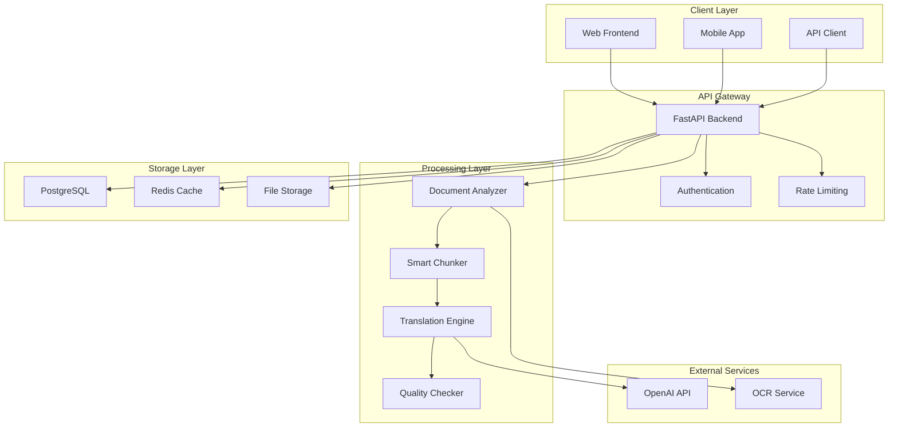

# PDF Translation Platform - Technical Architecture Proposal

## 🏗️ System Architecture Overview

This document outlines the technical architecture for an enhanced PDF translation platform that efficiently translates English academic documents to Persian (Farsi) using OpenAI's GPT-4 API.

## 📊 Current Architecture Analysis

### Existing Components
```
┌─────────────────┐    ┌─────────────────┐    ┌─────────────────┐
│   Frontend      │    │   Backend       │    │   Database      │
│   (Next.js)     │◄──►│   (FastAPI)     │◄──►│   (PostgreSQL)  │
└─────────────────┘    └─────────────────┘    └─────────────────┘
                              │
                              ▼
                       ┌─────────────────┐
                       │   Celery        │
                       │   (Redis)       │
                       └─────────────────┘
```

### Current Data Flow
1. **Upload**: PDF → FastAPI → Database
2. **Processing**: Celery Worker → PyMuPDF → OpenAI API
3. **Storage**: Translated text → Database
4. **Retrieval**: API → Frontend

## 🚀 Enhanced Architecture Proposal

### High-Level Architecture


## 🔧 Core Components Design

### 1. Document Analyzer Service

```python
class DocumentAnalyzer:
    """Analyzes PDF documents for optimal processing strategy"""
    
    def __init__(self):
        self.pdf_processor = PyMuPDFProcessor()
        self.layout_detector = LayoutDetector()
        self.complexity_scorer = ComplexityScorer()
    
    def analyze_document(self, file_path: str) -> DocumentAnalysis:
        """Comprehensive document analysis"""
        return DocumentAnalysis(
            metadata=self._extract_metadata(file_path),
            layout_info=self._analyze_layout(file_path),
            complexity_score=self._calculate_complexity(file_path),
            processing_strategy=self._recommend_strategy(file_path),
            cost_estimate=self._estimate_costs(file_path)
        )
    
    def _extract_metadata(self, file_path: str) -> Dict:
        """Extract document metadata"""
        doc = fitz.open(file_path)
        return {
            "total_pages": len(doc),
            "file_size": os.path.getsize(file_path),
            "creation_date": doc.metadata.get("creationDate"),
            "author": doc.metadata.get("author"),
            "title": doc.metadata.get("title"),
            "subject": doc.metadata.get("subject")
        }
    
    def _analyze_layout(self, file_path: str) -> LayoutInfo:
        """Analyze document layout and structure"""
        return LayoutInfo(
            has_images=self._detect_images(file_path),
            has_tables=self._detect_tables(file_path),
            has_footnotes=self._detect_footnotes(file_path),
            layout_type=self._classify_layout(file_path),
            text_density=self._calculate_text_density(file_path)
        )
    
    def _calculate_complexity(self, file_path: str) -> float:
        """Calculate document complexity score (0-1)"""
        factors = {
            "academic_terminology": self._count_academic_terms(file_path),
            "technical_content": self._detect_technical_content(file_path),
            "multilingual_content": self._detect_multilingual(file_path),
            "formatting_complexity": self._assess_formatting(file_path)
        }
        return self.complexity_scorer.calculate(factors)
```

### 2. Smart Chunking Strategy

```python
class SmartChunker:
    """Intelligent text chunking for optimal translation"""
    
    def __init__(self):
        self.token_counter = TokenCounter()
        self.semantic_analyzer = SemanticAnalyzer()
        self.max_tokens = 100000  # GPT-4 context limit
    
    def chunk_document(self, text: str, strategy: ChunkingStrategy) -> List[Chunk]:
        """Chunk document based on selected strategy"""
        if strategy == ChunkingStrategy.SEMANTIC:
            return self._semantic_chunking(text)
        elif strategy == ChunkingStrategy.TOKEN_BASED:
            return self._token_based_chunking(text)
        elif strategy == ChunkingStrategy.HYBRID:
            return self._hybrid_chunking(text)
        else:
            raise ValueError(f"Unknown chunking strategy: {strategy}")
    
    def _semantic_chunking(self, text: str) -> List[Chunk]:
        """Chunk by semantic units (paragraphs, sections)"""
        chunks = []
        paragraphs = text.split('\n\n')
        
        current_chunk = ""
        current_tokens = 0
        
        for paragraph in paragraphs:
            paragraph_tokens = self.token_counter.count(paragraph)
            
            if current_tokens + paragraph_tokens > self.max_tokens:
                if current_chunk:
                    chunks.append(Chunk(
                        text=current_chunk.strip(),
                        tokens=current_tokens,
                        type=ChunkType.SEMANTIC
                    ))
                current_chunk = paragraph
                current_tokens = paragraph_tokens
            else:
                current_chunk += "\n\n" + paragraph
                current_tokens += paragraph_tokens
        
        if current_chunk:
            chunks.append(Chunk(
                text=current_chunk.strip(),
                tokens=current_tokens,
                type=ChunkType.SEMANTIC
            ))
        
        return chunks
    
    def _token_based_chunking(self, text: str) -> List[Chunk]:
        """Chunk by token limits"""
        chunks = []
        sentences = self._split_sentences(text)
        
        current_chunk = ""
        current_tokens = 0
        
        for sentence in sentences:
            sentence_tokens = self.token_counter.count(sentence)
            
            if current_tokens + sentence_tokens > self.max_tokens:
                chunks.append(Chunk(
                    text=current_chunk.strip(),
                    tokens=current_tokens,
                    type=ChunkType.TOKEN_BASED
                ))
                current_chunk = sentence
                current_tokens = sentence_tokens
            else:
                current_chunk += " " + sentence
                current_tokens += sentence_tokens
        
        if current_chunk:
            chunks.append(Chunk(
                text=current_chunk.strip(),
                tokens=current_tokens,
                type=ChunkType.TOKEN_BASED
            ))
        
        return chunks
```

### 3. Persian Translation Engine

```python
class PersianTranslationEngine:
    """Specialized Persian translation engine"""
    
    def __init__(self):
        self.openai_client = OpenAI(api_key=settings.OPENAI_API_KEY)
        self.persian_processor = PersianTextProcessor()
        self.cost_tracker = CostTracker()
    
    def translate_chunk(self, chunk: Chunk, context: TranslationContext) -> TranslationResult:
        """Translate a single chunk with Persian optimization"""
        
        # Prepare Persian-specific prompt
        prompt = self._build_persian_prompt(chunk.text, context)
        
        # Estimate costs
        cost_estimate = self.cost_tracker.estimate_cost(chunk.tokens)
        
        try:
            # Call OpenAI API
            response = self.openai_client.chat.completions.create(
                model="gpt-4",
                messages=[
                    {"role": "system", "content": self._get_system_prompt()},
                    {"role": "user", "content": prompt}
                ],
                max_tokens=chunk.tokens * 1.5,  # Persian expansion factor
                temperature=0.1,  # Low temperature for consistency
                top_p=0.9
            )
            
            translated_text = response.choices[0].message.content
            
            # Process Persian text (RTL, shaping)
            processed_text = self.persian_processor.process(translated_text)
            
            # Track actual costs
            actual_cost = self.cost_tracker.calculate_actual_cost(response.usage)
            
            return TranslationResult(
                original_text=chunk.text,
                translated_text=processed_text,
                tokens_used=response.usage.total_tokens,
                cost=actual_cost,
                quality_score=self._assess_quality(chunk.text, processed_text),
                processing_time=time.time() - start_time
            )
            
        except Exception as e:
            logger.error(f"Translation failed for chunk: {e}")
            raise TranslationError(f"Failed to translate chunk: {e}")
    
    def _build_persian_prompt(self, text: str, context: TranslationContext) -> str:
        """Build Persian-specific translation prompt"""
        return f"""
        Translate the following English text to Persian (Farsi) with these specific requirements:
        
        1. **Academic Tone**: Use formal academic Persian appropriate for philosophical texts
        2. **Terminology**: Preserve technical terms and philosophical concepts accurately
        3. **Proper Nouns**: Handle names like "Werner Erhard" and "Martin Heidegger" appropriately
        4. **Structure**: Maintain the logical flow and argument structure
        5. **Formatting**: Preserve any formatting markers or special characters
        6. **Cultural Context**: Adapt cultural references appropriately for Persian readers
        
        **Context Information:**
        - Document Type: {context.document_type}
        - Subject Area: {context.subject_area}
        - Target Audience: {context.target_audience}
        
        **English Text:**
        {text}
        
        **Persian Translation:**
        """
    
    def _get_system_prompt(self) -> str:
        """Get system prompt for Persian translation"""
        return """
        You are a specialized Persian translator with expertise in academic and philosophical texts. 
        Your translations should be:
        - Academically rigorous and precise
        - Culturally appropriate for Persian readers
        - Faithful to the original meaning and tone
        - Properly formatted for Persian text (RTL)
        """
```

### 4. Quality Assurance System

```python
class QualityAssuranceSystem:
    """Comprehensive quality assurance for translations"""
    
    def __init__(self):
        self.length_validator = LengthValidator()
        self.terminology_checker = TerminologyChecker()
        self.format_validator = FormatValidator()
        self.coherence_analyzer = CoherenceAnalyzer()
    
    def assess_translation_quality(self, original: str, translated: str, context: TranslationContext) -> QualityReport:
        """Comprehensive quality assessment"""
        
        metrics = {
            "length_ratio": self.length_validator.validate_length_ratio(original, translated),
            "terminology_consistency": self.terminology_checker.check_consistency(original, translated),
            "format_preservation": self.format_validator.validate_format(original, translated),
            "coherence_score": self.coherence_analyzer.analyze_coherence(translated),
            "academic_tone": self._assess_academic_tone(translated),
            "cultural_appropriateness": self._assess_cultural_fit(translated, context)
        }
        
        overall_score = self._calculate_overall_score(metrics)
        
        return QualityReport(
            overall_score=overall_score,
            metrics=metrics,
            recommendations=self._generate_recommendations(metrics),
            needs_review=overall_score < 0.8
        )
    
    def _calculate_overall_score(self, metrics: Dict[str, float]) -> float:
        """Calculate weighted overall quality score"""
        weights = {
            "length_ratio": 0.15,
            "terminology_consistency": 0.25,
            "format_preservation": 0.20,
            "coherence_score": 0.20,
            "academic_tone": 0.15,
            "cultural_appropriateness": 0.05
        }
        
        weighted_sum = sum(metrics[key] * weights[key] for key in weights)
        return weighted_sum
```

## 🗄️ Database Schema Enhancements

### Enhanced Models

```python
class DocumentAnalysis(Base):
    __tablename__ = "document_analyses"
    
    id = Column(Integer, primary_key=True)
    document_id = Column(Integer, ForeignKey("pdf_documents.id"))
    analysis_data = Column(JSON)  # Complete analysis results
    complexity_score = Column(Float)
    recommended_strategy = Column(String(50))
    estimated_cost = Column(Float)
    processing_time = Column(Float)
    created_at = Column(DateTime, default=datetime.utcnow)

class TranslationChunk(Base):
    __tablename__ = "translation_chunks"
    
    id = Column(Integer, primary_key=True)
    page_id = Column(Integer, ForeignKey("pdf_pages.id"))
    chunk_index = Column(Integer)
    original_text = Column(Text)
    translated_text = Column(Text)
    chunk_type = Column(String(20))  # semantic, token_based, hybrid
    token_count = Column(Integer)
    translation_cost = Column(Float)
    quality_score = Column(Float)
    processing_time = Column(Float)
    created_at = Column(DateTime, default=datetime.utcnow)

class QualityReport(Base):
    __tablename__ = "quality_reports"
    
    id = Column(Integer, primary_key=True)
    chunk_id = Column(Integer, ForeignKey("translation_chunks.id"))
    overall_score = Column(Float)
    metrics = Column(JSON)
    recommendations = Column(JSON)
    needs_review = Column(Boolean, default=False)
    reviewed_by = Column(String(100))
    review_notes = Column(Text)
    created_at = Column(DateTime, default=datetime.utcnow)
```

## 🔄 Enhanced API Endpoints

### New Endpoints

```python
@router.post("/analyze/{document_id}")
async def analyze_document(document_id: int, db: Session = Depends(get_db)):
    """Analyze document for optimal processing strategy"""
    analyzer = DocumentAnalyzer()
    analysis = analyzer.analyze_document(document.file_path)
    
    # Save analysis to database
    db_analysis = DocumentAnalysis(
        document_id=document_id,
        analysis_data=analysis.dict(),
        complexity_score=analysis.complexity_score,
        recommended_strategy=analysis.processing_strategy,
        estimated_cost=analysis.cost_estimate
    )
    db.add(db_analysis)
    db.commit()
    
    return analysis

@router.post("/translate/{document_id}/smart")
async def smart_translate_document(
    document_id: int, 
    strategy: ChunkingStrategy,
    db: Session = Depends(get_db)
):
    """Start smart translation with specified strategy"""
    # Get document analysis
    analysis = db.query(DocumentAnalysis).filter(
        DocumentAnalysis.document_id == document_id
    ).first()
    
    if not analysis:
        raise HTTPException(404, "Document analysis not found")
    
    # Start smart translation task
    task = smart_translation_task.delay(document_id, strategy.value)
    
    return {
        "message": "Smart translation started",
        "task_id": task.id,
        "strategy": strategy.value,
        "estimated_cost": analysis.estimated_cost
    }

@router.get("/quality/{document_id}")
async def get_quality_report(document_id: int, db: Session = Depends(get_db)):
    """Get comprehensive quality report for document"""
    chunks = db.query(TranslationChunk).filter(
        TranslationChunk.page_id.in_(
            db.query(PDFPage.id).filter(PDFPage.document_id == document_id)
        )
    ).all()
    
    quality_reports = []
    for chunk in chunks:
        report = db.query(QualityReport).filter(
            QualityReport.chunk_id == chunk.id
        ).first()
        if report:
            quality_reports.append(report)
    
    return {
        "document_id": document_id,
        "total_chunks": len(chunks),
        "quality_reports": quality_reports,
        "overall_quality": sum(r.overall_score for r in quality_reports) / len(quality_reports) if quality_reports else 0
    }
```

## 🚀 Performance Optimization

### Caching Strategy

```python
class TranslationCache:
    """Intelligent caching for translations"""
    
    def __init__(self):
        self.redis_client = redis.Redis.from_url(settings.REDIS_URL)
        self.cache_ttl = 86400  # 24 hours
    
    def get_cached_translation(self, text_hash: str) -> Optional[str]:
        """Get cached translation if exists"""
        cached = self.redis_client.get(f"translation:{text_hash}")
        return cached.decode('utf-8') if cached else None
    
    def cache_translation(self, text_hash: str, translation: str):
        """Cache translation result"""
        self.redis_client.setex(
            f"translation:{text_hash}",
            self.cache_ttl,
            translation
        )
    
    def get_text_hash(self, text: str) -> str:
        """Generate hash for text"""
        return hashlib.md5(text.encode('utf-8')).hexdigest()
```

### Batch Processing

```python
class BatchProcessor:
    """Process multiple translations efficiently"""
    
    def __init__(self):
        self.translation_engine = PersianTranslationEngine()
        self.cache = TranslationCache()
    
    def process_batch(self, chunks: List[Chunk]) -> List[TranslationResult]:
        """Process multiple chunks efficiently"""
        results = []
        
        # Group chunks by similarity for better context
        grouped_chunks = self._group_similar_chunks(chunks)
        
        for group in grouped_chunks:
            group_results = self._process_group(group)
            results.extend(group_results)
        
        return results
    
    def _group_similar_chunks(self, chunks: List[Chunk]) -> List[List[Chunk]]:
        """Group similar chunks for better translation context"""
        # Implementation for grouping similar content
        pass
```

## 🔒 Security Architecture

### Data Protection

```python
class DataProtectionService:
    """Comprehensive data protection"""
    
    def __init__(self):
        self.encryption_key = settings.ENCRYPTION_KEY
        self.cipher = Fernet(self.encryption_key)
    
    def encrypt_sensitive_data(self, data: str) -> str:
        """Encrypt sensitive text data"""
        return self.cipher.encrypt(data.encode()).decode()
    
    def decrypt_sensitive_data(self, encrypted_data: str) -> str:
        """Decrypt sensitive text data"""
        return self.cipher.decrypt(encrypted_data.encode()).decode()
    
    def secure_file_storage(self, file_path: str):
        """Ensure secure file storage with proper permissions"""
        os.chmod(file_path, 0o600)  # Read/write for owner only
    
    def auto_cleanup(self, file_path: str, ttl_hours: int = 24):
        """Automatically clean up files after TTL"""
        schedule.enter(ttl_hours * 3600, 1, self._delete_file, (file_path,))
```

## 📊 Monitoring & Analytics

### Performance Monitoring

```python
class PerformanceMonitor:
    """Monitor system performance and costs"""
    
    def __init__(self):
        self.metrics_collector = MetricsCollector()
        self.cost_tracker = CostTracker()
    
    def track_translation_metrics(self, result: TranslationResult):
        """Track translation performance metrics"""
        self.metrics_collector.record({
            "processing_time": result.processing_time,
            "tokens_used": result.tokens_used,
            "cost": result.cost,
            "quality_score": result.quality_score
        })
    
    def generate_performance_report(self, time_range: str) -> PerformanceReport:
        """Generate comprehensive performance report"""
        metrics = self.metrics_collector.get_metrics(time_range)
        costs = self.cost_tracker.get_costs(time_range)
        
        return PerformanceReport(
            avg_processing_time=metrics.avg_processing_time,
            total_cost=costs.total_cost,
            avg_quality_score=metrics.avg_quality_score,
            throughput=metrics.throughput,
            recommendations=self._generate_recommendations(metrics, costs)
        )
```

## 🎯 Implementation Priority

### Phase 1: Core Enhancements
1. **Document Analyzer**: Implement comprehensive document analysis
2. **Smart Chunking**: Add semantic and hybrid chunking strategies
3. **Persian Optimization**: Enhance translation prompts and text processing
4. **Cost Tracking**: Implement real-time cost monitoring

### Phase 2: Advanced Features
1. **Quality Assurance**: Comprehensive quality assessment system
2. **Caching**: Intelligent translation caching
3. **Batch Processing**: Efficient batch translation processing
4. **Performance Monitoring**: Real-time performance tracking

### Phase 3: Production Ready
1. **Security**: Enhanced data protection and encryption
2. **Scalability**: Load balancing and horizontal scaling
3. **Monitoring**: Comprehensive monitoring and alerting
4. **Documentation**: Complete API and system documentation

---

*This architecture proposal provides a comprehensive foundation for building a production-ready PDF translation platform with advanced Persian language support and optimal performance characteristics.*
