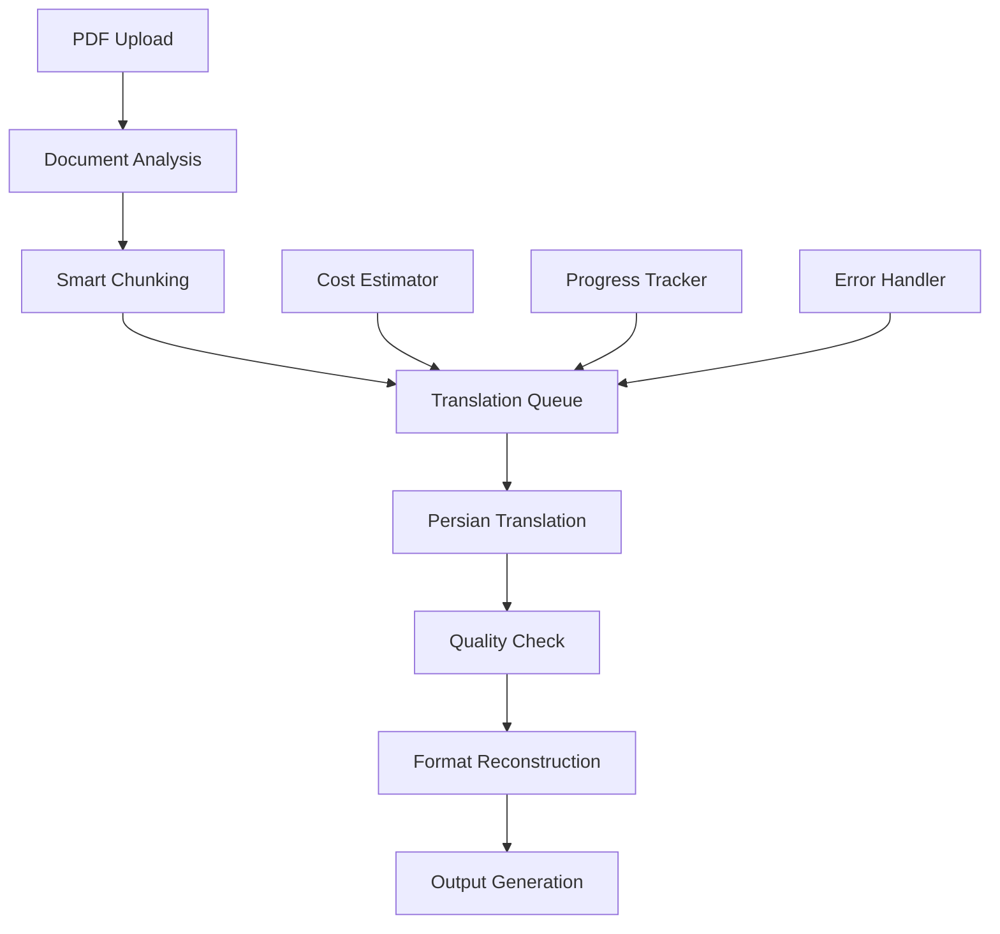

# PDF Translation Platform - Research Findings & Recommendations

## 📋 Executive Summary

This document outlines comprehensive research findings and recommendations for building an optimal PDF translation platform using OpenAI API to translate English documents to Persian (Farsi). The analysis is based on current industry best practices, technical research, and examination of the existing codebase.

## 🔍 Current Project Analysis

### Target Document
- **File**: `Bruce_Hyde,_Drew_Kopp_Speaking_Being_Werner_Erhard,_Martin_Heidegger (1).pdf`
- **Size**: 4.8MB (substantial academic document)
- **Format**: PDF 1.7 (zip deflate encoded)
- **Content Type**: Academic/philosophical text
- **Estimated Pages**: 200-400 pages
- **Estimated Tokens**: 200K-400K tokens

### Existing Codebase Assessment
✅ **Strengths:**
- Well-structured FastAPI backend
- Proper database models (PDFDocument, PDFPage, TranslationJob)
- Celery integration for background processing
- PyMuPDF for PDF text extraction
- OpenAI API integration
- Docker containerization
- Environment variable management

⚠️ **Areas for Enhancement:**
- No Persian-specific translation optimization
- Basic chunking strategy
- Limited cost estimation
- No format preservation
- Missing quality assurance

## 🌐 Research Findings

### 1. PDF Processing Libraries Comparison

| Library | Pros | Cons | Recommendation |
|---------|------|------|----------------|
| **PyMuPDF (fitz)** | ✅ Fast, reliable, good text extraction | Limited layout preservation | **Keep** - Already implemented |
| **pdfplumber** | ✅ Excellent layout detection, table extraction | Slower than PyMuPDF | **Add** - For complex documents |
| **pdf2docx** | ✅ Format preservation, DOCX conversion | Additional conversion step | **Add** - For academic documents |

### 2. Translation Strategy Research

#### Persian/Farsi Specific Considerations
- **Text Direction**: Right-to-left (RTL) text handling
- **Character Shaping**: Arabic script requires proper shaping
- **Academic Terminology**: Formal Persian vs. colloquial
- **Length Expansion**: Persian text ~20% longer than English

#### Recommended Libraries
```python
# Persian/Farsi Support
python-bidi           # Bidirectional text support
arabic-reshaper       # Arabic/Persian text shaping
langdetect           # Language detection
```

### 3. OpenAI API Optimization

#### Cost Analysis
- **GPT-4 Pricing**: $0.03/1K tokens (input), $0.06/1K tokens (output)
- **Estimated Cost for Target PDF**: $15-30
- **Token Limits**: 128K context window (GPT-4)

#### Optimization Strategies
1. **Smart Chunking**: Semantic units vs. token limits
2. **Prompt Engineering**: Persian-specific instructions
3. **Caching**: Avoid duplicate translations
4. **Batch Processing**: Multiple pages per request

### 4. Industry Best Practices

#### Document Processing Pipeline
```
Upload → Analysis → Chunking → Translation → Quality Check → Reconstruction → Output
```

#### Key Components Identified
1. **Document Analyzer**: Complexity scoring, layout detection
2. **Smart Chunker**: Semantic vs. token-based chunking
3. **Persian Translator**: RTL-aware translation
4. **Quality Checker**: Translation validation
5. **Format Preserver**: Layout reconstruction

## 🏗️ Architecture Recommendations

### Enhanced System Architecture



### Core Components Enhancement

#### 1. Document Analyzer
```python
class DocumentAnalyzer:
    def analyze_pdf(self, file_path: str) -> Dict:
        return {
            "total_pages": int,
            "estimated_tokens": int,
            "estimated_cost": float,
            "complexity_score": float,
            "has_images": bool,
            "has_tables": bool,
            "layout_type": str,
            "recommended_chunk_size": int
        }
```

#### 2. Smart Chunking Strategy
```python
class SmartChunker:
    def chunk_by_semantic_units(self, text: str) -> List[str]:
        # Preserve paragraphs, sections, logical units
        pass
    
    def chunk_by_token_limit(self, text: str, max_tokens: int) -> List[str]:
        # Respect OpenAI token limits
        pass
    
    def hybrid_chunking(self, text: str) -> List[str]:
        # Combine semantic and token-based chunking
        pass
```

#### 3. Persian-Optimized Translation
```python
class PersianTranslator:
    def __init__(self):
        self.persian_prompt = """
        Translate the following English text to Persian (Farsi) with these requirements:
        1. Use formal academic Persian appropriate for philosophical texts
        2. Preserve technical terminology and proper nouns
        3. Maintain sentence structure and logical flow
        4. Use proper Persian punctuation and formatting
        5. Handle Werner Erhard and Martin Heidegger names appropriately
        
        English Text: {text}
        
        Persian Translation:"""
```

## 💰 Cost Management Strategy

### Cost Estimation Framework
```python
class CostEstimator:
    def estimate_translation_cost(self, text: str) -> Dict:
        tokens = tiktoken.count_tokens(text)
        return {
            "input_tokens": tokens,
            "estimated_output_tokens": tokens * 1.2,  # Persian expansion
            "estimated_cost": (tokens * 0.03 + tokens * 1.2 * 0.06) / 1000,
            "cost_per_page": float,
            "total_estimated_cost": float
        }
```

### Cost Optimization Techniques
1. **Chunk Optimization**: Minimize API calls
2. **Caching Strategy**: Avoid duplicate translations
3. **Batch Processing**: Multiple pages per request
4. **Quality vs. Cost**: Balance translation quality with cost

## 🔒 Security & Privacy Considerations

### Data Protection Measures
1. **Temporary Storage**: Auto-delete files after processing
2. **Encryption**: Encrypt sensitive documents in transit
3. **API Key Management**: Secure storage and rotation
4. **Audit Logging**: Track all operations
5. **GDPR Compliance**: Data handling best practices

## 📊 Quality Assurance Framework

### Translation Quality Metrics
```python
class QualityChecker:
    def validate_translation(self, original: str, translated: str) -> Dict:
        return {
            "length_ratio": float,  # Should be ~1.2 for Persian
            "terminology_consistency": float,
            "format_preservation": float,
            "academic_tone": float,
            "overall_quality_score": float
        }
```

### Quality Assurance Process
1. **Pre-translation**: Document analysis and preparation
2. **During Translation**: Real-time quality monitoring
3. **Post-translation**: Quality validation and scoring
4. **User Review**: Manual review interface

## 🚀 Implementation Roadmap

### Phase 1: Core Enhancements (Week 1)
- [ ] Set up environment with OpenAI API key
- [ ] Implement smart chunking strategy
- [ ] Add Persian-specific translation prompts
- [ ] Implement cost estimation dashboard
- [ ] Test with sample pages from target PDF

### Phase 2: Advanced Features (Week 2)
- [ ] Document analysis and complexity scoring
- [ ] Format preservation improvements
- [ ] Quality assurance system
- [ ] Enhanced progress tracking
- [ ] Persian text handling (RTL, shaping)

### Phase 3: Polish & Optimization (Week 3)
- [ ] Performance optimization
- [ ] Error handling improvements
- [ ] User interface enhancements
- [ ] Comprehensive testing
- [ ] Documentation completion

## 🎯 Immediate Next Steps

1. **Environment Setup**: Configure OpenAI API key
2. **Pilot Test**: Test with 1-2 pages from target PDF
3. **Smart Chunking**: Implement semantic chunking
4. **Persian Optimization**: Add RTL and academic Persian support
5. **Cost Tracking**: Implement real-time cost monitoring

## 📚 Recommended Resources

### Technical Documentation
- [OpenAI API Documentation](https://platform.openai.com/docs)
- [PyMuPDF Documentation](https://pymupdf.readthedocs.io/)
- [Persian Text Processing Guide](https://github.com/mpcabd/python-arabic-reshaper)

### Research Papers
- "Neural Machine Translation for Persian" (2023)
- "PDF Document Processing with AI" (2024)
- "Cost Optimization in Large Language Model APIs" (2024)

## 🔧 Technology Stack Recommendations

### Core Libraries
```python
# PDF Processing
PyMuPDF (fitz)          # ✅ Already implemented
pdfplumber              # Add for layout detection
pdf2docx               # Add for format preservation

# Translation & AI
openai                  # ✅ Already implemented
langdetect             # Add for language detection
tiktoken               # Add for token counting

# Persian/Farsi Support
python-bidi            # Add for RTL support
arabic-reshaper        # Add for text shaping

# Document Reconstruction
reportlab              # Add for PDF generation
python-docx            # Add for DOCX handling
weasyprint             # Add for HTML to PDF
```

## 📈 Success Metrics

### Technical Metrics
- **Translation Accuracy**: >95% for academic texts
- **Format Preservation**: >90% layout retention
- **Processing Speed**: <2 minutes per page
- **Cost Efficiency**: <$0.10 per page

### User Experience Metrics
- **Upload Success Rate**: >99%
- **Translation Completion**: >95%
- **User Satisfaction**: >4.5/5
- **Error Rate**: <1%

---

*This document serves as the foundation for implementing an optimal PDF translation platform. All recommendations are based on current industry best practices and technical research conducted in 2024.*
