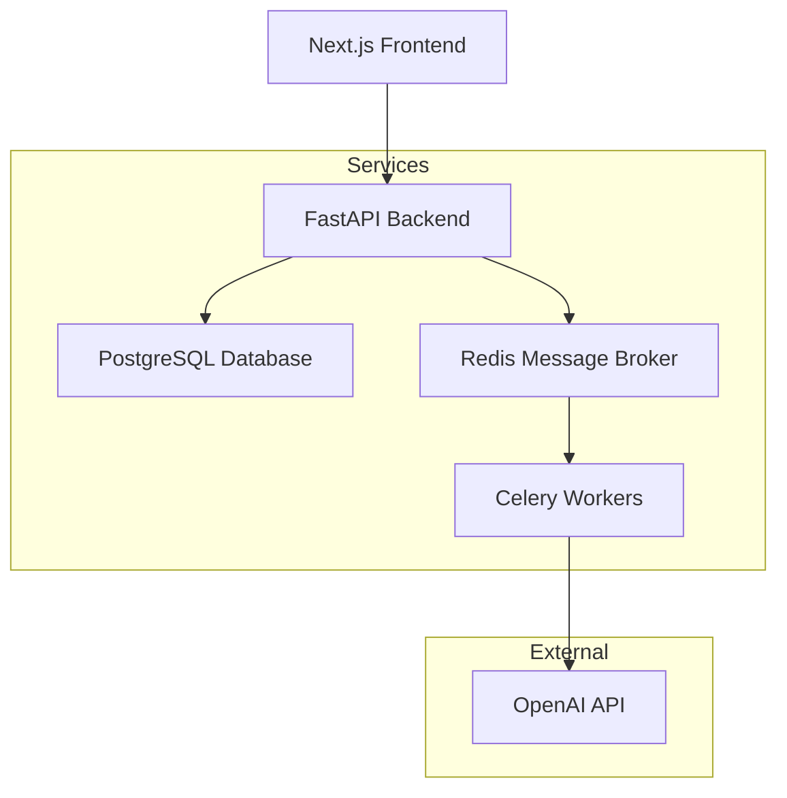

# PDF Translation Platform

Welcome to the **Advanced PDF Translation Platform** - a comprehensive solution for translating English PDF documents to Persian using OpenAI's GPT models.

## 🚀 Features

- **Full PDF Processing**: Extract text from PDFs using PyMuPDF
- **Database Storage**: PostgreSQL for persistent storage of documents and translations
- **Test Translation**: Translate individual pages for testing before full processing
- **Async Processing**: Celery workers for scalable background translation
- **REST API**: Comprehensive FastAPI backend with automatic documentation
- **Modern Frontend**: Next.js with Tailwind CSS and React components
- **Docker Ready**: Complete containerization with Docker Compose
- **Monitoring**: Celery Flower for task monitoring
- **Production Ready**: Health checks, error handling, and proper logging

## 🏗️ Architecture



## 🚀 Quick Start

1. **Clone the repository**
   ```bash
   git clone https://github.com/mbaneshi/pdf-translation-platform.git
   cd pdf-translation-platform
   ```

2. **Set up environment**
   ```bash
   cp env.example .env
   # Edit .env and add your OpenAI API key
   ```

3. **Start the platform**
   ```bash
   ./start.sh
   ```

4. **Access the application**
   - Frontend: http://localhost:3000
   - API: http://localhost:8000
   - API Docs: http://localhost:8000/docs
   - Celery Monitor: http://localhost:5555

## 📚 Documentation

- [Installation Guide](getting-started/installation.md)
- [API Reference](api/endpoints.md)
- [Architecture Overview](architecture/overview.md)
- [Development Guide](development/contributing.md)

## 🤝 Contributing

We welcome contributions! Please see our [Contributing Guide](development/contributing.md) for details.

## 📄 License

This project is licensed under the MIT License - see the [LICENSE](LICENSE) file for details.

## 🆘 Support

- Create an [issue](https://github.com/mbaneshi/pdf-translation-platform/issues) for bug reports
- Start a [discussion](https://github.com/mbaneshi/pdf-translation-platform/discussions) for questions
- Check our [troubleshooting guide](translation/troubleshooting.md)
